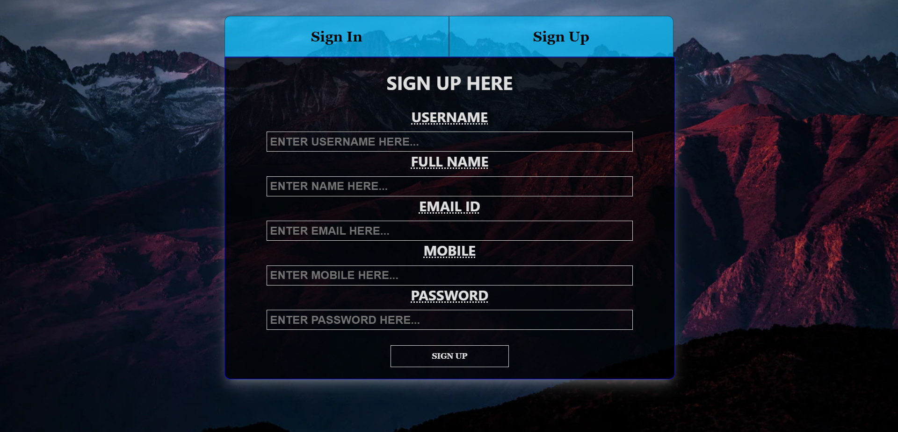
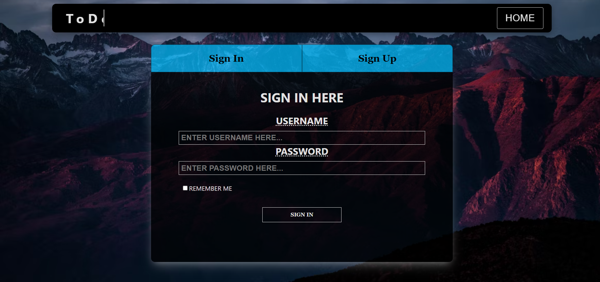
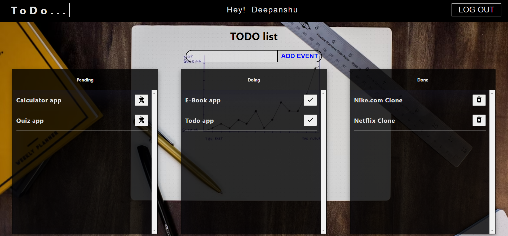
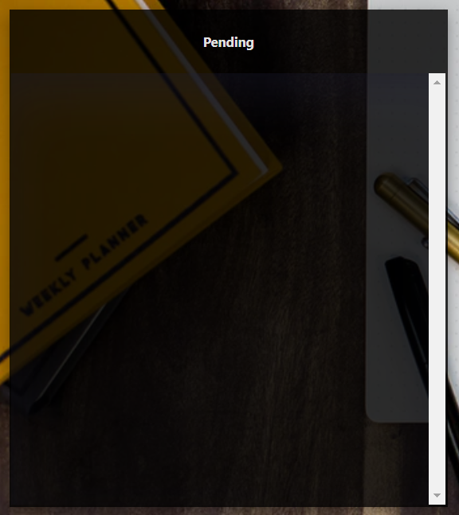
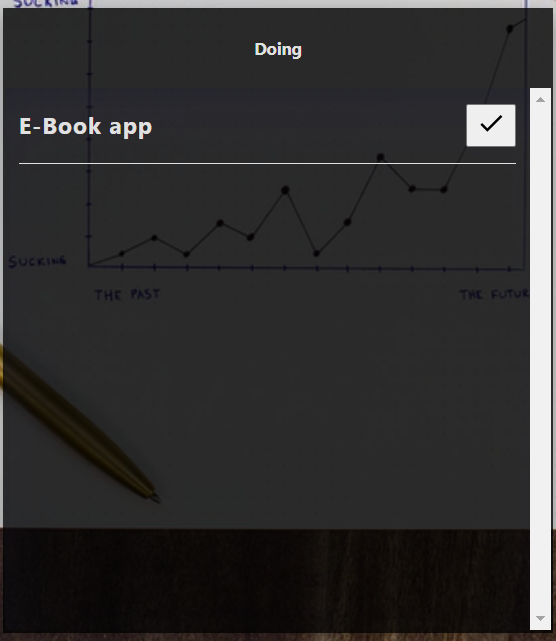
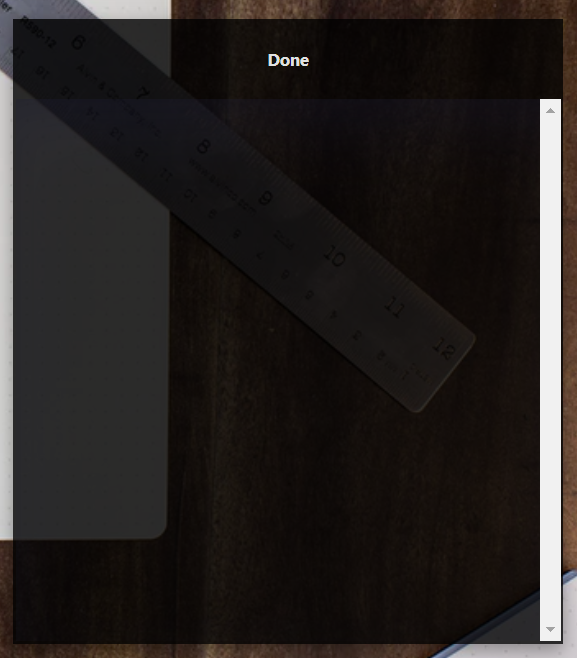

# TODO-list
 
# About the Website

## This website is a todo web application. In this application you can add task as pending then change status to doing then done and then you can delete. This web application have signin and signup feature too. Every user have its own data.
 

# Features

* ##  Sign-up

 

* ##  Sign-in

 

* ##  Home page

 

* ##  Event page

 

* ##  Pending section of event page

 

* ##  Doing section of event page

 

* ##  Done section of event page

 

## TechStacks
* React
* Redux
* Material UI
* MongoDB
* ExpreeJS
* NodeJS
* JavaScript
* CSS
* Heroku
* Vercel

